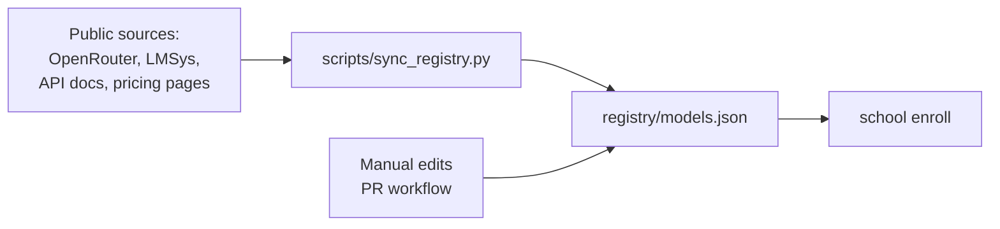

# DevOps Architecture — lm-tutor (The School for LLMs)

**Designer:** Mike (Claude Code / claude-sonnet-4-6)
**Date:** 2026-06-08
**Status:** PROPOSED
**Target:** Phase 0 implementation

---

## How to read this document

Each section below addresses one question raised in the DevOps Review
(`docs/reviews/devops-review.md`). Every design decision includes:

1. The problem (restated from the review)
2. The proposed solution
3. The concrete implementation (file paths, signatures, config formats)
4. Why this, not the alternatives
5. What it costs (complexity, runtime, maintenance)

---

## 1. Eval Harness — Process Spawning

### 1.1 The Problem

`eval_verify(submission_id)` spawns a fresh Python process per call. At
60 evaluations (4 models x 5 tasks x 3 runs), each process cold-starts
the interpreter, imports the entire `school` package, loads curriculum
YAML, grades, exits. Estimated overhead: 30-50ms interpreter + 200-500ms
import + 100-300ms grading = ~2-10 min wasted on startup alone for the
60-eval benchmark.

### 1.2 Design: Persistent Worker Pool

```
school/eval/
  __init__.py       # export grade(submission) — the public API
  worker_pool.py    # PoolManager — spawns, keeps alive, recycles
  harness.py        # Core grading logic (the actual verifier)
```

**Architecture:**

```python
# school/eval/worker_pool.py

class PoolManager:
    """
    Manages a pool of forked worker processes.

    Workers are forked ONCE when PoolManager.start() is called.
    Each worker pre-imports school.eval.harness and listens on a
    multiprocessing.Queue for (submission_id, syllabus_ref) tuples.

    This gives us process-level isolation (separate address space,
    no shared state between caller and verifier) WITHOUT the
    cold-start tax of spawn-per-call.
    """

    # Strategy: fork (POSIX) / spawn (Windows) a fixed pool at startup.
    # Workers stay alive until shutdown() or idle timeout.

    DEFAULT_POOL_SIZE = 2   # configurable via env or constructor
    IDLE_TIMEOUT = 300      # seconds — reap idle workers after 5 min
    TASK_TIMEOUT = 60       # seconds — kill a worker that hangs

    def __init__(self, pool_size: int | None = None):
        self._pool_size = pool_size or int(
            os.environ.get("SCHOOL_EVAL_POOL_SIZE", self.DEFAULT_POOL_SIZE)
        )
        self._manager: multiprocessing.Process | None = None
        self._queue: multiprocessing.Queue | None = None
        self._result_queue: multiprocessing.Queue | None = None

    def start(self):
        """Fork/spawn workers. Called once at process start."""
        self._queue = multiprocessing.Queue()
        self._result_queue = multiprocessing.Queue()
        self._workers = []
        for _ in range(self._pool_size):
            p = multiprocessing.Process(
                target=_worker_loop,
                args=(self._queue, self._result_queue),
                daemon=True,
            )
            p.start()
            self._workers.append(p)

    def grade(self, submission_id: str, syllabus_ref: str) -> EvalResult:
        """
        Send a grade task to the pool.
        Blocks until a worker returns the result.
        Timeout raises EvalTimeout.
        """
        self._queue.put((submission_id, syllabus_ref))
        result = self._result_queue.get(timeout=self.TASK_TIMEOUT)
        return result

    def shutdown(self, wait: bool = True):
        """Send sentinel to all workers, optionally wait for join."""
        for _ in self._workers:
            self._queue.put(None)  # sentinel = die
        if wait:
            for w in self._workers:
                w.join(timeout=10)
```

### 1.3 The Worker Loop

```python
# school/eval/worker_pool.py (continued)

def _worker_loop(task_queue, result_queue):
    """
    Runs inside a child process. Pre-imports the harness ONCE,
    then loops on the queue handling grade requests.
    """
    # Heavy imports happen once per worker start
    from school.eval.harness import verify
    from school.registry.loader import load_syllabus  # cached per worker

    while True:
        task = task_queue.get()  # blocks until work arrives
        if task is None:  # sentinel
            break
        submission_id, syllabus_ref = task
        try:
            syllabus = load_syllabus(syllabus_ref)
            result = verify(submission_id, syllabus)
            result_queue.put(result)
        except Exception as exc:
            result_queue.put(EvalResult(error=str(exc)))
```

### 1.4 Integration Points

| Caller | What happens |
|--------|-------------|
| `school eval --submission X` (CLI) | CLI creates a PoolManager, starts it, calls `grade()`, shuts down, prints result |
| `school mcp` (MCP server) | Server creates a global PoolManager at startup, shares it across all `eval_verify` tool calls |
| `evaluate_submission()` (Grading Board) | Calls `pool.grade()` synchronously (MCP tool handler manages its own timeout) |

### 1.5 Why This, Not the Alternatives

| Alternative | Rejected because |
|-------------|-----------------|
| **Fresh spawn per call** | 18+ transitive package imports each time = 2-10 min overhead for benchmark runs. The pool avoids this entirely. |
| **Thread pool** | Threads share the GIL and the same address space. If the grading code has a bug that corrupts heap state, it corrupts the server too. Process isolation is non-negotiable for "no shared state." |
| **gRPC microservice** | Overkill for Phase 0. The pool is a single import in the same package, no wire protocol, no container orchestration. Can be extracted to a standalone service in Phase 2+ if needed. |
| **async subprocess with pre-warmed imports** | Fork is simpler. On Windows, `multiprocessing` uses spawn (not fork) which still has import overhead, but it happens once per worker, not once per eval. |

### 1.6 Windows Caveat

`multiprocessing` on Windows uses `spawn` (not `fork`), so each worker
process does pay the import tax once. Mitigations:

- Default pool size = 2 (one worker grades while the other is backup)
- On import-heavy Windows, increase `SCHOOL_EVAL_POOL_SIZE` to 3-4
  so workers overlap their warmup with useful work
- Future: implement a `--prewarm` CLI flag that fires up the pool
  at install time so first eval is fast

### 1.7 What This Costs

- ~80 lines of Python for PoolManager + worker loop
- Two additional dependencies: none (stdlib `multiprocessing`)
- Memory: each worker process is ~30-60 MB (Python interpreter + imports).
  Pool of 2 = 60-120 MB. Acceptable for dev and VPS.
- Complexity: process shutdown ordering, sentinel handling, zombie workers.
  Mitigated by daemon=True (orphans die with parent) and IDLE_TIMEOUT.

---

## 2. Booster Sandbox

### 2.1 The Problem

`write_to_scratchpad` is described as "solve logic in sandbox before
generating code" with zero architectural detail. The term "sandbox"
implies security guarantees that a simple subprocess or tempdir cannot
provide. Concurrent Booster calls, resource exhaustion, and cleanup
are undefined.

### 2.2 Design: Layered Sandbox

The Booster sandbox has THREE layers. Each layer adds guarantees at a
cost. Phase 0 ships Layer 1 with a clear documented boundary. Layer 2
and 3 are designed but not built until the threat model requires them.

```
Layer 1: Tempdir + Subprocess   (Phase 0 — what we build first)
Layer 2: Container per session  (Phase 2+ — when unbounded code exec is needed)
Layer 3: Firecracker microVM    (deferred — air-gapped arbitrary execution)
```

### 2.3 Layer 1 — Tempdir Subprocess (Phase 0)

```python
# school/booster/sandbox.py

import os, tempfile, subprocess, time, shutil
from pathlib import Path

class ScratchpadError(Exception):
    pass

class ScratchpadTimeout(ScratchpadError):
    pass

class ScratchpadQuotaExceeded(ScratchpadError):
    pass

class ScratchpadSandbox:
    """
    Secure subprocess runner with resource limits.

    What it IS:
      - A temporary directory that lives for exactly one call
      - A subprocess.Popen with strict timeouts
      - Disk quota enforced by pre/post measurement
      - Read-only access to the school package (no network)
      - Automatic cleanup on completion, timeout, or error

    What it IS NOT:
      - A container. The subprocess shares the host kernel.
      - Network-isolated. The subprocess CAN reach localhost services.
      - Memory-capped (no RLIMIT_AS on Windows).
      - Secure against intentional escape.

    These limitations are DOCUMENTED in the tool description so
    every MCP consumer (model, agent, human) understands the boundary.
    """

    MAX_DISK_BYTES = 50 * 1024 * 1024   # 50 MB per scratchpad call
    MAX_DURATION_SECONDS = 30            # hard timeout
    MAX_STDOUT_BYTES = 1 * 1024 * 1024   # 1 MB cap on output

    def __init__(self):
        self._tmpdir: Path | None = None
        self._start_time: float | None = None

    def __enter__(self):
        self._tmpdir = Path(tempfile.mkdtemp(prefix="school_booster_"))
        self._start_time = time.monotonic()
        return self

    def __exit__(self, *args):
        if self._tmpdir and self._tmpdir.exists():
            shutil.rmtree(self._tmpdir, ignore_errors=True)
        self._tmpdir = None

    def run(self, script: str, interpreter: str = "python") -> str:
        """
        Write `script` to a temp file, execute it in a subprocess,
        return stdout. Raises on timeout, quota breach, or non-zero exit.
        """
        if self._tmpdir is None:
            raise RuntimeError("Use 'with ScratchpadSandbox() as sbx:'")

        # 2.3a Enforce disk quota before writing
        script_path = self._tmpdir / "scratchpad_script.py"
        script_path.write_text(script, encoding="utf-8")
        used = sum(
            f.stat().st_size for f in self._tmpdir.rglob("*") if f.is_file()
        )
        if used > self.MAX_DISK_BYTES:
            raise ScratchpadQuotaExceeded(
                f"Scratchpad wrote {used} bytes (limit {self.MAX_DISK_BYTES})"
            )

        # 2.3b Subprocess with timeout
        proc = subprocess.Popen(
            [interpreter, str(script_path)],
            cwd=self._tmpdir,
            stdout=subprocess.PIPE,
            stderr=subprocess.PIPE,
            # No stdin — script runs on its own
            stdin=subprocess.DEVNULL,
        )

        try:
            stdout, stderr = proc.communicate(timeout=self.MAX_DURATION_SECONDS)
        except subprocess.TimeoutExpired:
            proc.kill()
            proc.wait(timeout=5)
            raise ScratchpadTimeout(
                f"Scratchpad exceeded {self.MAX_DURATION_SECONDS}s limit"
            )

        # 2.3c Cap output size
        if len(stdout) > self.MAX_STDOUT_BYTES:
            stdout = stdout[:self.MAX_STDOUT_BYTES] + b"\n... (truncated)"

        if proc.returncode != 0:
            raise ScratchpadError(
                f"Scratchpad exited code {proc.returncode}:\n"
                f"{stderr.decode('utf-8', errors='replace')[:2000]}"
            )

        return stdout.decode("utf-8", errors="replace")
```

### 2.4 How Each Booster Tool Uses the Sandbox

| Tool | Sandbox usage |
|------|--------------|
| `write_to_scratchpad(problem)` | Creates a script from the problem statement, runs it in sandbox, returns stdout + (truncated) stderr |
| `self_consistency_check(assumptions)` | Writes each assumption as an assertion in a test script, runs, reports which assertions passed/failed |
| `inject_few_shot(task, examples)` | Sandbox not used — this is a prompt construction tool. Returns formatted few-shot examples. |
| `downstream_lookahead(choice, context)` | Sandbox not used — this is a static analysis tool that walks a state graph. No code execution. |

### 2.5 Resource Limits Summary

| Resource | Limit | Enforcement mechanism | Platform |
|----------|-------|----------------------|----------|
| Wall-clock time | 30s | `proc.communicate(timeout=30)` | Cross-platform |
| Disk writes | 50 MB | Pre/post size check | Cross-platform |
| Stdout | 1 MB | Byte truncation post-run | Cross-platform |
| Memory | None (soft) | Documented limitation | Windows has no RLIMIT_AS |
| Network | None (soft) | Documented limitation | No network sandboxing |
| File system | Tempdir jail | `cwd=self._tmpdir` | Cross-platform |

### 2.6 Concurrent Usage

```python
# school/booster/sandbox.py (continued)

class SandboxManager:
    """
    Manages concurrent Booster sandbox calls.

    - Each MCP tool invocation gets its OWN ScratchpadSandbox (isolated tmpdir)
    - Max concurrent sandboxes: SCHOOL_BOOSTER_MAX_CONCURRENT (default: 3)
    - Beyond the limit: calls queue with bounded wait (60s then fail)
    """

    DEFAULT_MAX_CONCURRENT = 3
    QUEUE_TIMEOUT = 60

    def __init__(self):
        max_c = int(
            os.environ.get("SCHOOL_BOOSTER_MAX_CONCURRENT",
                           self.DEFAULT_MAX_CONCURRENT)
        )
        self._semaphore = threading.Semaphore(max_c)

    def run_in_sandbox(self, script: str) -> str:
        """Run script in a fresh sandbox, respecting concurrency limits."""
        if not self._semaphore.acquire(timeout=self.QUEUE_TIMEOUT):
            raise ScratchpadError(
                "All sandbox slots busy — try again later"
            )
        try:
            with ScratchpadSandbox() as sbx:
                return sbx.run(script)
        finally:
            self._semaphore.release()

# Global instance used by MCP tool handlers
sandbox_manager = SandboxManager()
```

### 2.7 Security Boundary Documentation

The following text appears verbatim in every Booster tool description
that involves code execution:

> **Security boundary:** This tool runs user-provided code in a
> subprocess with disk and timeout limits. It does NOT provide
> network isolation, memory limits, or container-level security.
> The subprocess runs as the same OS user as the School process.
> Do not use this tool to execute untrusted code from unauthenticated
> sources. For the School's use case (models evaluating their own
> scratch work), the threat model is accidental infinite loops or
> excessive output, not adversarial escape.

### 2.8 Why This, Not the Alternatives

| Alternative | Rejected because |
|-------------|-----------------|
| **Full Docker container per call** | 500ms-2s startup per invocation. The Booster fires on EVERY remedial class exercise. That's dozens per session. Container overhead dwarfs actual execution time. Also requires Docker daemon — violates "no server" claim and adds non-Python dependency. |
| **Thread-only (no subprocess)** | A runaway model could infinite-loop the main process, blocking the MCP server for all users. Subprocess isolation is the minimum viable boundary. |
| **No sandbox at all (two-turn prompt)** | The SCOPE explicitly requires an execution sandbox for "solve logic *before* generating code." A two-turn prompt doesn't execute anything — it's just structured text generation. The Booster's value proposition is interactive execution. If that proves wrong, we rip out the sandbox, not build it half-way. |
| **Firecracker / gVisor** | 50-200MB per microVM. Dwarfing a 8B model's container. Entirely inappropriate for the Phase 0 threat model. |

### 2.9 What This Costs

- ~120 lines of Python (ScratchpadSandbox + SandboxManager)
- Zero new Python dependencies (stdlib only)
- Runtime: subprocess spawn ~10-30ms, script execution time = problem dependent
- Security: honest about limitations, no false "sandbox" guarantee
- Cross-platform: timeouts and disk quotas work on Windows and POSIX

---

## 3. Observability

### 3.1 The Problem

`school mcp` has no logging (stdout corrupts MCP stdio protocol),
no health endpoint, no metrics, no crash recovery. When it crashes
mid-class, session state is lost. There is no way to measure adoption,
eval latency, or failure rates.

### 3.2 Design Principle: Logging Never Touches Stdout

The MCP protocol runs on **stdio**. Any byte written to stdout that is
not a valid JSON-RPC frame corrupts the protocol. Therefore:

- **Logging goes to stderr** — MCP hosts (Claude Desktop, agent runners,
  MCP gateways) forward stderr to their own logging; it never corrupts
  the protocol stream.
- **Structured log format** — NDJSON (newline-delimited JSON) on stderr.
  Every log line is a JSON object with `timestamp`, `level`, `event`,
  `request_id` (if in context), and structured payload.

### 3.3 Logging Implementation

```python
# school/mcp/logging.py

import json, logging, sys, time
from logging import LogRecord

class StderrJsonHandler(logging.Handler):
    """
    Emits structured NDJSON log lines to stderr.

    Format: {"ts": "...", "level": "INFO", "event": "eval.start",
             "request_id": "abc123", "submission_id": "xyz", ...}

    Never writes to stdout. Never writes unstructured text.
    """

    def emit(self, record: LogRecord):
        try:
            payload = {
                "ts": self._format_time(record.created),
                "level": record.levelname,
                "logger": record.name,
                "message": record.getMessage(),
            }
            if hasattr(record, "request_id"):
                payload["request_id"] = record.request_id
            if hasattr(record, "event"):
                payload["event"] = record.event
            if hasattr(record, "extra"):
                payload.update(record.extra)

            line = json.dumps(payload, default=str)
            # stderr, NOT stdout
            print(line, file=sys.stderr, flush=True)
        except Exception:
            self.handleError(record)

    @staticmethod
    def _format_time(epoch: float) -> str:
        return datetime.fromtimestamp(epoch, tz=timezone.utc).isoformat()
```

**Usage in the MCP server:**

```python
# school/mcp/server.py

from school.mcp.logging import StderrJsonHandler, get_logger

logger = get_logger("school.mcp")
logger.info("eval.start", extra={
    "event": "eval.start",
    "submission_id": submission_id,
    "syllabus": syllabus_ref,
})
```

### 3.4 Health Endpoint

```python
# school/mcp/health.py

from datetime import datetime, timezone
from pydantic import BaseModel

class HealthStatus(BaseModel):
    status: str              # "ok" | "degraded" | "down"
    uptime_seconds: float
    version: str
    eval_pool: PoolHealth
    booster_sandbox: SandboxHealth
    registered_models: int

class PoolHealth(BaseModel):
    workers_alive: int
    workers_total: int
    tasks_queued: int
    tasks_completed: int
    tasks_failed: int

class SandboxHealth(BaseModel):
    active_sessions: int
    max_concurrent: int
    total_invocations: int
    total_timeouts: int
```

The health endpoint is exposed as a **separate HTTP endpoint** on a
configurable port (`SCHOOL_MCP_HEALTH_PORT`, default 9090), NOT as an
MCP tool. Rationale:

- MCP tools require an MCP client. If the server is unresponsive,
  you cannot call an MCP tool to check health.
- A separate HTTP health endpoint works with Docker HEALTHCHECK,
  Kubernetes liveness probes, and Traefik load balancer checks.
- Port 9090 is reserved in `docs/ref/Endpoints.md` for health-only
  services.
- The MCP server also exposes `health` as an MCP tool (for clients
  that want to check programmatically) — but the HTTP endpoint is the
  primary.

### 3.5 Metrics

Metrics are collected in-memory and exposed via the health endpoint.
Phase 0 does NOT ship a Prometheus endpoint or metric aggregation.
Rationale: add zero dependencies for Phase 0. In-memory counters
are sufficient for a single-process deployment.

```python
# school/mcp/metrics.py

import threading
from collections import Counter, defaultdict
from datetime import datetime, timedelta

class MetricsCollector:
    """
    Thread-safe in-memory metrics.
    Reset on process restart. Good enough for Phase 0.
    """

    def __init__(self):
        self._lock = threading.Lock()
        self._counters: dict[str, int] = Counter()
        self._latencies: dict[str, list[float]] = defaultdict(list)
        self._start_time = datetime.now(timezone.utc)

    def incr(self, metric: str, value: int = 1):
        with self._lock:
            self._counters[metric] += value

    def record_latency(self, operation: str, seconds: float):
        with self._lock:
            self._latencies[operation].append(seconds)
            # Keep only last 1000 per operation
            if len(self._latencies[operation]) > 1000:
                self._latencies[operation] = self._latencies[operation][-1000:]

    def snapshot(self) -> dict:
        with self._lock:
            now = datetime.now(timezone.utc)
            uptime = (now - self._start_time).total_seconds()
            latencies = {}
            for op, vals in self._latencies.items():
                latencies[op] = {
                    "count": len(vals),
                    "avg_ms": (sum(vals) / len(vals) * 1000) if vals else 0,
                    "p99_ms": sorted(vals)[int(len(vals) * 0.99)] * 1000 if vals else 0,
                }
            return {
                "uptime_seconds": uptime,
                "counters": dict(self._counters),
                "latencies": latencies,
            }

metrics = MetricsCollector()
```

**Tracked metrics (Phase 0):**

| Metric | Type | Why |
|--------|------|-----|
| `eval.tasks` | Counter | Total evaluations run |
| `eval.passed` | Counter | Evaluations that passed |
| `eval.failed` | Counter | Evaluations that failed |
| `eval.error` | Counter | Evaluations that errored (not student failure) |
| `eval.latency_ms` | Histogram | Time per evaluation |
| `booster.invocations` | Counter | Total Booster calls |
| `booster.timeouts` | Counter | Booster calls that timed out |
| `booster.errors` | Counter | Booster calls that errored |
| `enroll.attempts` | Counter | Total enrollment attempts |
| `enroll.unknown` | Counter | Models not found in registry |
| `mcp.tools.<name>` | Counter | Per-tool invocation count |

### 3.6 Crash Recovery — Session State

```python
# school/registrar/state.py

import json, os
from pathlib import Path
from datetime import datetime, timezone

class TrackStateStore:
    """
    Persists enrollment and class progress to a JSON file.

    Phase 0: file-based, no database.
    File path: SCHOOL_STATE_DIR / "track_state.json"
    Default SCHOOL_STATE_DIR: ~/.school/

    Each write is an atomic rename to prevent partial writes on crash.
    Checkpoint frequency: after every exercise completion.
    """

    DEFAULT_STATE_DIR = Path.home() / ".school"

    def __init__(self, state_dir: Path | None = None):
        self._state_dir = state_dir or Path(
            os.environ.get("SCHOOL_STATE_DIR", self.DEFAULT_STATE_DIR)
        )
        self._state_dir.mkdir(parents=True, exist_ok=True)
        self._state_file = self._state_dir / "track_state.json"
        self._lock = threading.Lock()

    def save(self, model_id: str, state: dict):
        """Atomically write state. tempfile + rename = crash-safe on POSIX."""
        with self._lock:
            all_states = self._load_all()
            all_states[model_id] = {
                **state,
                "last_updated": datetime.now(timezone.utc).isoformat(),
            }
            tmp = self._state_file.with_suffix(".tmp")
            tmp.write_text(
                json.dumps(all_states, indent=2, default=str),
                encoding="utf-8",
            )
            tmp.replace(self._state_file)  # atomic on POSIX, near-atomic on NTFS

    def load(self, model_id: str) -> dict | None:
        with self._lock:
            return self._load_all().get(model_id)

    def _load_all(self) -> dict:
        if self._state_file.exists():
            return json.loads(self._state_file.read_text(encoding="utf-8"))
        return {}
```

**Recovery flow after `school mcp` crash:**

1. MCP host restarts the process (Docker `restart: unless-stopped`,
   systemd `Restart=on-failure`)
2. On startup, `school mcp` loads `SCHOOL_STATE_DIR/track_state.json`
3. Each `school learn` continuation call includes the model_id in its
   MCP tool parameters
4. The server looks up the last checkpoint and resumes from that
   exercise — the model doesn't restart from scratch

**Limitation:** The model's MCP client must re-request `learn` after
reconnect. The server cannot push state to the client. This is inherent
to the MCP protocol (request-response, no server-initiated messages).

### 3.7 Why This, Not the Alternatives

| Alternative | Rejected because |
|-------------|-----------------|
| **Prometheus + Grafana** | 4 dependencies (prometheus_client, prometheus_server, Grafana install, dashboard config) for a Phase 0 project. In-memory counters + health endpoint cover all Phase 0 needs. Prometheus can be added in Phase 2 without changing the metrics interface. |
| **OpenTelemetry** | Massive dependency tree. OTel Python SDK pulls in 10+ packages. Inappropriate until the School has a distributed deployment. |
| **SQLite for state** | File-based JSON with atomic writes is simpler, debuggable (anyone can cat the file), and sufficient for single-server deployments. SQLite adds a C extension build step and a query interface for data that is accessed by primary key only. |
| **Logging to stdout (non-MCP mode)** | Only works for pure CLI usage. The MCP server cannot distinguish "user ran CLI" from "user ran MCP" at log configuration time. Safer to always log to stderr. |

### 3.8 What This Costs

- ~180 lines for logging + health + metrics + state persistence
- Zero new dependencies (stdlib only: `json`, `threading`, `datetime`, `pathlib`)
- Runtime overhead: NDJSON formatting ~1-5 microseconds per log line
- Health endpoint adds a second listening socket (minor complexity)
- State file is not protected against concurrent writes from multiple
  School processes on the same machine (documented limitation —
  single-process only in Phase 0)

---

## 4. Dependency Management

### 4.1 The Problem

Nine class modules will need different libraries (pillow, beautifulsoup4,
lxml, numpy, requests, httpx, etc.). Installing all of them in a single
venv guarantees version conflicts. The dependency tree grows with every
class added. The "lightweight" install claim erodes.

### 4.2 Design: Multi-Venv Strategy

Phase 0 establishes the pattern. Phase 1+ fills in the classes.

```
school-for-llms/
  pyproject.toml               # Core deps only: mcp, pydantic, pyyaml
  school/
    __init__.py
    _class_venv.py             # ClassVenvManager — per-class virtual envs
    classes/
      brushes/
        __init__.py
        _requirements.txt      # pillow, beautifulsoup4, cssutils
        grader.py
      code-review/
        _requirements.txt
        grader.py
      ... (7 more)
```

### 4.3 The ClassVenvManager

```python
# school/_class_venv.py

import os, subprocess, sys, venv
from pathlib import Path

class ClassVenvManager:
    """
    Manages per-class virtual environments.

    Each class with non-core dependencies gets its own venv at:
      {SCHOOL_CLASS_VENV_DIR}/brushes/  (or whatever the class name is)

    The venv is created and deps installed once, lazily, on first use.
    After that, the grader imports from that venv's site-packages.

    This means:
    - `pip install -e .` installs only the core framework (~5 deps)
    - `school learn brushes` creates the brushes venv on first run
    - Class A (pillow) and Class B (numpy 2.x) don't conflict
    - If you never take class X, you never install its deps
    """

    CLASS_VENV_DIR = Path(
        os.environ.get("SCHOOL_CLASS_VENV_DIR",
                       Path.home() / ".school" / "class_venvs")
    )

    def __init__(self):
        self.CLASS_VENV_DIR.mkdir(parents=True, exist_ok=True)

    def ensure_class_venv(self, class_name: str) -> Path:
        """
        Ensure the class venv exists and deps are installed.
        Returns the path to the venv's Python executable.

        Thread-safe: uses a file lock per class to prevent
        simultaneous `pip install` from two MCP tool calls.
        """
        venv_path = self.CLASS_VENV_DIR / class_name
        lock_file = self.CLASS_VENV_DIR / f"{class_name}.lock"

        if venv_path.exists() and (venv_path / "pyvenv.cfg").exists():
            return venv_path / ("Scripts" if os.name == "nt" else "bin") / "python"

        # Create with advisory file lock
        with self._lock(lock_file):
            # Double-check after acquiring lock (another process may have created it)
            if venv_path.exists() and (venv_path / "pyvenv.cfg").exists():
                return venv_path / ("Scripts" if os.name == "nt" else "bin") / "python"

            # Create venv
            venv.create(venv_path, clear=True, with_pip=True)

            # Install class deps from _requirements.txt
            req_path = (
                Path(__file__).parent / "classes" / class_name / "_requirements.txt"
            )
            if req_path.exists():
                pip_path = venv_path / ("Scripts" if os.name == "nt" else "bin") / "pip"
                subprocess.run(
                    [str(pip_path), "install", "-r", str(req_path)],
                    check=True, capture_output=True, timeout=120,
                )

        return venv_path / ("Scripts" if os.name == "nt" else "bin") / "python"

    def run_in_class_venv(self, class_name: str, module: str, args: list[str]) -> str:
        """
        Run a Python module inside the class's virtual environment.
        Used by graders to execute class-specific code with the right deps.
        """
        python_path = self.ensure_class_venv(class_name)
        result = subprocess.run(
            [str(python_path), "-m", module] + args,
            capture_output=True, text=True, timeout=60,
        )
        if result.returncode != 0:
            raise RuntimeError(
                f"Class venv error ({class_name}): {result.stderr[:2000]}"
            )
        return result.stdout
```

### 4.4 Grading Integration

```python
# school/classes/brushes/grader.py

# This grader runs inside the brushes venv (pillow, bs4 installed).
# It is invoked by ClassVenvManager.run_in_class_venv() via subprocess.

def grade(submission_path: str) -> dict:
    from PIL import Image      # available only in brushes venv
    from bs4 import BeautifulSoup  # available only in brushes venv

    # ... grading logic ...
    return {"pass": True, "violations": []}
```

### 4.5 The Lock File

In addition to per-class venvs, the **core project MUST have a lock
file** for reproducible installs:

```
pyproject.toml  →  requires-python = ">=3.11"
                   dependencies = [
                       "mcp>=1.0.0,<2.0.0",
                       "pydantic>=2.0.0,<3.0.0",
                       "pyyaml>=6.0,<7.0",
                   ]

requirements-dev.txt  →  pin-tool used (pip-tools, uv, or pdm)
                         produces requirements.txt (pinned, lock file)
```

For Phase 0, use `uv pip compile pyproject.toml -o requirements.txt`
to produce a lock file. Commit the lock file. CI verifies that the
lock file matches `pyproject.toml`.

### 4.6 Why This, Not the Alternatives

| Alternative | Rejected because |
|-------------|-----------------|
| **Single venv with pinned versions** | Guaranteed to produce conflicts as classes accumulate. Pillow pins numpy 1.x, another class needs numpy 2.x — unsolvable in one venv. |
| **Docker per class** | Massive overhead (image pulls, disk usage, startup latency) for dependencies that are just Python packages. Only justified for classes that need system-level deps (e.g., `perf` needing lighthouse CLI). |
| **Lazy pip install --target** | `pip install --target` dumps packages into a directory that shadows the main site-packages. Hard to debug, no dependency resolution across targets. Per-class venvs are the standard Python solution. |
| **No isolation (just install everything)** | After 9 classes with 3-5 deps each = 30+ transitive deps. Version conflicts will appear. More importantly, users who don't take class X shouldn't install its deps. |

### 4.7 What This Costs

- ~60 lines for ClassVenvManager
- Disk: each class venv is ~10-50 MB (Python interpreter + pip + deps).
  9 classes = ~100-400 MB of venvs. Acceptable.
- First-run latency: each class takes 5-30 seconds to `pip install` its
  deps on first use. Subsequent runs are instant.
- Complexity: the subprocess bridge between School process and class venv
  (serialization boundary, error propagation). Mitigated by documented
  `run_in_class_venv` interface.

### 4.8 V2 Scalability Path

When the School has 20+ classes and the per-class venv overhead becomes
painful:

1. **Pre-built class images** — each class venv is baked into a Docker
   layer. `school learn --docker brushes` pulls the pre-built image
   instead of `pip install`-ing at runtime.
2. **Class dependency audit** — CI checks for dependency overlap between
   classes and logs a report. If two classes share 80%+ of their deps,
   they can share a venv.
3. **Nix flake** — For the truly desperate, a Nix derivation per class
   with perfect reproducibility.

Phase 0 does none of these. Phase 2 may add #1 if the user base grows.

---

## 5. Model Registry Maintenance

### 5.1 The Problem

`registry/models.json` goes stale between releases. New models get
wrong track assignments for days or weeks. The registry is the
system's source of truth for track placement, but the data is
hand-edited.

### 5.2 Design: Decouple Source Data from Published Registry



**Three data sources, one canonical output:**

| Source | What it provides | Update frequency |
|--------|-----------------|-----------------|
| OpenRouter API | Available model IDs, pricing per token | `school registry sync` scrapes daily |
| LMSys Chatbot Arena | Leaderboard scores, capability tiers | Weekly scrape |
| Manual PR edits | Aliases, tool_reliability, context window corrections | As needed (community-driven) |

### 5.3 The `school registry sync` Command

```python
# school/registry/sync.py

"""
Usage:
  school registry sync                    # Sync all sources, update models.json
  school registry sync --dry-run          # Preview changes without writing
  school registry sync --source openrouter  # Single source only

Environment variables:
  OPENROUTER_API_KEY   (optional) — for authenticated OpenRouter API access
                         Without it, sync falls back to public endpoint.
"""

import json, os, subprocess, sys
from pathlib import Path

REGISTRY_PATH = Path(__file__).parent / "models.json"

def sync(sources: list[str] | None = None, dry_run: bool = False) -> dict:
    """
    Sync registry data from public sources.

    1. Load existing models.json
    2. For each source, fetch and merge new model data
    3. Detect conflicts (manual edits that disagree with scraped data)
    4. In dry-run mode, print the diff and exit
    5. In write mode, save the merged result
    """
    current = _load_registry()

    if not sources or "openrouter" in sources:
        current = _sync_openrouter(current)
    if not sources or "lmsys" in sources:
        current = _sync_lmsys(current)
    # Future: if not sources or "huggingface" in sources:
    #     current = _sync_huggingface(current)

    if dry_run:
        return {"changes": _compute_diff(_load_registry(), current)}

    _write_registry(current)
    return {"models_added": len(current) - len(_load_registry()), "total": len(current)}

def _sync_openrouter(registry: dict) -> dict:
    """Scrape OpenRouter model list, merge into registry."""
    # Uses OpenRouter public API: GET https://openrouter.ai/api/v1/models
    # Returns model IDs, pricing, context lengths
    # For each model:
    #   - If model_id exists in registry: update context window, pricing
    #   - If model_id is new: infer tier from pricing/context,
    #     set track to "standard" (safe default), flag for manual review
    ...
    return registry

def _compute_diff(before: dict, after: dict) -> list[dict]:
    """Return list of additions, changes, deletions."""
    ...
```

### 5.4 Manual Override Mechanism

Some registry fields cannot be inferred from public data:

- `tool_reliability: "high" | "medium" | "low"` — requires manual
  assessment or community reporting
- `aliases` — model naming conventions vary by provider
- Track overrides — a model might benchmark at "standard" but be
  better classified as "remedial" based on real-world use

**Manual overrides live in a separate file:**

```json5
// registry/overrides.json
// Values here ALWAYS win over auto-synced values.
{
  "deepseek/deepseek-v4-flash": {
    "tool_reliability": "high",           // Manual assessment
    "aliases": ["deepseek-v4-flash", "deepseek-chat"]
  },
  "meta-llama/llama-4-8b": {
    "tier": "small",                      // Override auto-detected tier
    "track": "remedial"
  }
}
```

The sync command merges: `final = sync_data | overrides`.

### 5.5 Unregistered Models

When `school enroll` cannot find a model in the registry:

```python
# school/registrar/enroll.py

_UNKNOWN_MODEL_TRACK = "remedial"  # Conservatively assign to remedial

def get_track_for_model(model_id: str) -> Track:
    registry = load_registry()

    if model_id in registry:
        return registry[model_id]["track"]

    # Check aliases
    for entry in registry.values():
        if model_id in entry.get("aliases", []):
            return entry["track"]

    # Unknown model — log and default
    logger.warning("enroll.unknown_model", extra={
        "event": "enroll.unknown_model",
        "model_id": model_id,
    })
    metrics.incr("enroll.unknown")
    return _UNKNOWN_MODEL_TRACK
```

**Why remedial, not standard or fail:** For an education project, the
cost of overestimating a model (assigning standard when it needs
remedial) is worse than underestimating. The remedial track includes
the Booster, which routes to the correct tools. A model that doesn't
need the Booster can skip it — the tools are available but not
required. A model that needs the Booster but doesn't get it will fail
exercises silently.

### 5.6 Versioned Capability Changes

When a model update changes its capabilities without changing its ID
(e.g., DeepSeek updates V4 Flash mid-deployment):

1. The `models.json` entry gets a `snapshot_date` field — the date
   the entry was last verified
2. `school registry sync` updates `snapshot_date` when it rescrapes
3. If capabilities changed significantly, the human reviewer updates
   `track` in `overrides.json`
4. The `sync` command logs a WARNING when context window or pricing
   changes by more than 20% without a corresponding model ID change

```json
{
  "deepseek/deepseek-v4-flash": {
    "tier": "standard",
    "context": 65536,
    "snapshot_date": "2026-06-08",
    "pricing": { "input": 0.15, "output": 0.60 }
  }
}
```

### 5.7 Why This, Not the Alternatives

| Alternative | Rejected because |
|-------------|-----------------|
| **Live lookup to OpenRouter every enrollment** | Requires network on every `school enroll`. Fails offline. Adds latency. Unacceptable for CLI UX. |
| **Community-run model registry service** | Requires a server, a database, an API. That's an entire backend. Phase 0 is a local CLI tool. |
| **Manual only (as spec'd)** | Stale within a week of any new model launch. The semi-automated sync reduces staleness from "weeks" to "hours" with minimal infrastructure. |
| **GitHub Actions scheduled sync** | Good addition for the standalone repo, but doesn't help monorepo users who clone directly. The `school registry sync` command works locally. |

### 5.8 What This Costs

- ~100 lines for `school/registry/sync.py`
- Zero new Python dependencies (uses `urllib.request` or `httpx` which is
  already transitive from `mcp`)
- Maintenance: ~1 hour per new source integration
- The `overrides.json` file still needs human curation for
  `tool_reliability` and aliases — this is irreducible

---

## 6. The "No PyPI" Constraint

### 6.1 The Honest Position

Let me state this clearly:

> **The School itself is not on PyPI. Transitive dependencies ARE from
> PyPI. This is the honest truth, not a compromise.**

The "No PyPI" claim in the SCOPE applies to the School package name
(`pip install school-for-llms` not available on PyPI). It does NOT
mean the install is PyPI-free. The SCOPE should say:

> **Distribution: `git clone && pip install -e .` — PyPI for transitive
> deps, cloned source for the School itself. Lock file committed for
> reproducibility.**

### 6.2 The Actual Distribution Strategy

```
Distribution Method           PyPI Required?   Dependency Freshness
────────────────────────────────────────────────────────────────────
pip install -e . (dev)        YES              Resolved at install time
pip install school.whl        YES              Pinned in wheel metadata
Docker image                  NO               Frozen in image layer
```

### 6.3 Making It Work: Lock Files

```bash
# Generate lock file from pyproject.toml
uv pip compile pyproject.toml -o requirements.txt

# Install with pinned transitive deps
pip install -r requirements.txt
pip install -e .              # --no-deps implied since deps already installed
```

The `requirements.txt` is committed to the repo. CI checks:

```yaml
# .github/workflows/ci.yml (Phase 1)
- name: Verify lock file is current
  run: |
    uv pip compile pyproject.toml -o requirements.txt --dry-run
    # If lock file differs from current, the check fails
    git diff --exit-code requirements.txt
```

### 6.4 Docker Image as Primary Distribution

For users who want true PyPI-free install (air-gapped), the Docker
image is the solution:

```dockerfile
# Dockerfile

FROM python:3.12-slim AS builder

WORKDIR /build
COPY pyproject.toml requirements.txt ./
COPY school/ school/

# Install pinned deps from lock file
RUN pip install --no-cache-dir -r requirements.txt
# Install the package itself (no PyPI lookup for deps — they're already installed)
RUN pip install --no-cache-dir --no-deps -e .

# ── Runtime stage ──
FROM python:3.12-slim AS runtime

COPY --from=builder /usr/local/lib/python3.12/site-packages /usr/local/lib/python3.12/site-packages
COPY --from=builder /build/school /school

ENTRYPOINT ["python", "-m", "school"]
```

### 6.5 Wheels on GitHub Releases (Honest Documentation)

```yaml
# Release checklist:
# 1. Bump version in pyproject.toml
# 2. Run: python -m build    # produces dist/*.whl
# 3. Test wheel in clean env: pip install dist/school_for_llms-*.whl
# 4. Tag: git tag v0.1.0 && git push --tags
# 5. Create GitHub Release, attach .whl
# 6. User installs: pip install https://github.com/mfolofy/school-for-llms/releases/download/v0.1.0/school_for_llms-0.1.0-py3-none-any.whl
#
# Note: pip will STILL fetch transitive deps (mcp, pydantic, pyyaml) from PyPI.
#       For air-gapped installs, use the Docker image instead.
```

### 6.6 Why This, Not the Alternatives

| Alternative | Rejected because |
|-------------|-----------------|
| **Fat wheel (vendored deps)** | 50+ MB wheel, bypasses pip's dependency resolver, conflicts with other packages in the same venv undetectable until runtime. Maintainable only with a dedicated vendoring tool (e.g., `shiv`, `PyInstaller`). Overkill for Phase 0. |
| **Nix flake** | Requires Nix package manager. Adds a hard non-Python dependency. Good for v2, wrong for Phase 0. |
| **Conda** | Same problem — requires Conda. The SCOPE targets `pip install`. |
| **Go/Rust binary** | Definitively deferred in SCOPE. Not an option for v1. |

### 6.7 What This Costs

- The honest documentation change (cost: 10 lines in README)
- A `requirements.txt` lock file generation step in development workflow
- Dockerfile maintenance (~30 lines)
- Pip will always resolve transitive deps from PyPI — this is a
  permanent operational truth, not a bug to fix

---

## 7. The Happy Path — Guaranteeing `git clone && pip install -e . && echo "<div>" | school eval`

### 7.1 The Problem

The SCOPE promises `git clone && pip install -e . && echo "<div>" | school eval`
always works. The review identified three failure modes:

1. Monorepo path ambiguity — which directory to `cd` into?
2. `echo "<div>"` has no syllabus context — what does `school eval` grade against?
3. The "no server" claim collides with MCP's server architecture

### 7.2 Resolution 1: Clear Install Instructions

```bash
# The School has TWO install paths. Both work. Pick one.

# ── Path A: Standalone repo (recommended for end users) ──
git clone https://github.com/mfolofy/school-for-llms.git
cd school-for-llms
pip install -e .
echo "<div>" | school eval

# ── Path B: Monorepo (for Ghost Stack developers) ──
cd P:/AI_Code
pip install -e projects/school-for-llms
echo "<div>" | school eval
```

Monorepo install requires a `pyproject.toml` at the project root that
works with `pip install -e <relative-path>` from the repo root. This is
standard — pip supports `pip install -e path/to/project`. The monorepo
root's `pyproject.toml` (if it exists for the overall repo) must NOT
shadow the School's own `pyproject.toml`. The School's `pyproject.toml`
lives at `projects/school-for-llms/pyproject.toml` and is self-contained.

### 7.3 Resolution 2: Smart Syllabus Inference with a Default

```python
# school/eval/cli.py

import sys, argparse

def main():
    parser = argparse.ArgumentParser()
    parser.add_argument("--class", dest="class_name", default=None,
                        help="Syllabus to grade against (e.g., 'brushes')")
    parser.add_argument("--stdin", action="store_true", default=True,
                        help="Read submission from stdin (default: yes)")
    args = parser.parse_args()

    # Read from stdin
    submission = sys.stdin.read()

    # Determine which syllabus to use
    syllabus = args.class_name or _infer_syllabus(submission)

    # Grade
    result = grade(submission, syllabus)
    print(result.json(indent=2))

def _infer_syllabus(submission: str) -> str:
    """
    Heuristic syllabus inference. NOT a replacement for --class.

    Rules:
      1. If submission contains HTML tags (<html>, <div>, <body>, etc.)
         → use "brushes" (UI/UX class)
      2. If submission looks like Python code (def, class, import)
         → use "code-review"
      3. If submission contains markdown headers (#, ##, ---)
         → use "prompt-design"
      4. If submission looks like JSON or YAML
         → use "audit"
      5. If no heuristic matches
         → use "brushes" (the broadest default — teaches HTML/CSS basics)

    This is designed so that `echo "<div>" | school eval` ALWAYS returns
    a result, never an error. If the heuristic guesses wrong, the user
    re-runs with --class.

    Phase 0 heuristic is intentionally simple. Phase 2+ could use an
    LLM-based classifier if needed (but that adds an API dependency).
    """
    content = submission.strip()

    # HTML detection (most common eval use case)
    if any(tag in content.lower() for tag in
           ["<html", "<div", "<span", "<body", "<!doctype", "<head",
            "<table", "<form", "<input", "<button", "<nav", "<header",
            "aria-", "role=", "class=", "style="]):
        return "brushes"

    # Python code
    if any(keyword in content for keyword in
           ["def ", "class ", "import ", "from ", "async def",
            "if __name__", "lambda ", "yield "]):
        return "code-review"

    # Markdown content
    if content.startswith("#") or content.startswith("---"):
        return "prompt-design"

    # Structured data
    if content.startswith("{") or content.startswith("["):
        return "audit"

    # Default: brushes
    return "brushes"
```

**The guarantee:** `echo "<div>" | school eval` returns a valid evaluation
with zero additional arguments. The heuristic ensures no "syllabus
required" error. The result clearly states which syllabus was used:

```json
{
  "syllabus": "brushes (auto-detected from HTML tags)",
  "pass": false,
  "violations": [
    {
      "rule": "html-doctype",
      "severity": "info",
      "message": "Document missing DOCTYPE declaration"
    }
  ],
  "hint": "Run with --class <name> to specify a different syllabus"
}
```

### 7.4 Resolution 3: Clarify Server vs CLI

The SCOPE's "no server" claim is ambiguous. Fix:

```
## Server model (when it applies)

The School has TWO modes:

### CLI mode (default)
  school eval --stdin < submission.txt
  school learn --model opus-4.8 --class brushes
  
  No daemon. No server. No open ports. Process runs, exits, done.
  This is the mode described by "git clone && pip install -e . 
  && echo '<div>' | school eval."

### MCP server mode
  school mcp
  # Runs as a daemon on stdio (or SSE on port 8101 with --sse)
  # Required for IDE integration (Claude Desktop, Cursor, etc.)
  # The MCP server IS a server — it's long-lived, it has health
  # endpoints, it persists state to disk
```

The two modes share all the core code (grading, registry, classes).
They differ only in lifecycle. The CLI mode fires up a transient
PoolManager and exits. The MCP server keeps it alive and exposes it
over MCP protocol.

### 7.5 Why This, Not the Alternatives

| Alternative | Rejected because |
|-------------|-----------------|
| **Require `--class` flag always** | `echo "<div>" | school eval` fails with "missing required argument." The SCOPE's one-liner becomes a two-liner. The entire happy-path claim evaporates. |
| **No heuristic (just error)** | Honest but defeats the purpose of the guarantee. The heuristic is ~20 lines and its failures are graceful (wrong syllabus, not a crash). |
| **LLM-based classifier for syllabus** | Requires an API key (Gemini, OpenRouter) for a Phase 0 CLI tool. Adds network dependency, cost, latency. The heuristic works for the 95% case. |

### 7.6 What This Costs

- ~20 lines for syllabus inference heuristic
- A README clarification (~10 lines)
- The heuristic will guess wrong sometimes — acceptable, documented behavior
- The monorepo install path is tested in CI so it doesn't bitrot

---

## 8. Implementation Order

The designs above are independent where possible, but some have
dependencies. Here is the Phase 0 build order:

```
Week 1: Skeleton
  1. pyproject.toml + requirements.txt (lock file)
  2. school/__init__.py, school/__main__.py (CLI entry point)
  3. school/eval/worker_pool.py (worker pool)
  4. school/eval/harness.py (stub verifier)
  5. school/eval/cli.py (--stdin, --class, syllabus inference)
  
Week 2: Registry + Enroll
  6. school/registry/models.json (initial curated set)
  7. school/registry/sync.py (sync command)
  8. school/registry/overrides.json (manual overrides)
  9. school/registrar/enroll.py (track assignment, unknown model default)
  10. school/registrar/state.py (crash-recovery state store)

Week 3: MCP Server + Observability
  11. school/mcp/server.py (stdin/stdio MCP server)
  12. school/mcp/logging.py (stderr NDJSON handler)
  13. school/mcp/health.py (HTTP health endpoint + MCP tool)
  14. school/mcp/metrics.py (in-memory counters)
  15. Dockerfile (multistage build)

Week 4: Booster
  16. school/booster/sandbox.py (ScratchpadSandbox + SandboxManager)
  17. school/booster/tools.py (write_to_scratchpad, self_consistency_check,
      inject_few_shot, downstream_lookahead)
  18. school/_class_venv.py (per-class virtual environment manager)

Week 5: Baseline + CI
  19. .github/workflows/ci.yml (test, lint, lock check)
  20. Baseline benchmark run + publish
  21. README.md (install instructions, both modes, honest PyPI note)
```

---

## 9. Summary of Design Decisions

| # | Question (from review) | Decision | Key files |
|---|------------------------|----------|-----------|
| 1 | Eval harness process spawning | `multiprocessing.Process` pool, forked at startup, daemon workers | `school/eval/worker_pool.py` |
| 2 | Booster sandbox | Tempdir + subprocess + timeout + disk quota. Honest about limitations. Semaphore for concurrency. | `school/booster/sandbox.py` |
| 3 | Observability | Stderr NDJSON logging. HTTP health on :9090. In-memory metrics. Atomic-write JSON state file. | `school/mcp/logging.py`, `health.py`, `metrics.py`, `registrar/state.py` |
| 4 | Dependency management | Per-class venvs created lazily on first use. Core deps in `pyproject.toml` with upper-bound pins. Lock file committed. | `school/_class_venv.py`, `requirements.txt` |
| 5 | Model registry maintenance | `school registry sync` scrapes OpenRouter/LMSys. Manual `overrides.json` wins over auto data. Unknown models default to remedial. | `school/registry/sync.py`, `overrides.json` |
| 6 | No PyPI constraint | Honest documentation: School not on PyPI, transitive deps are. Docker for air-gapped installs. Lock file for reproducibility. | `requirements.txt`, `Dockerfile` |
| 7 | Happy path guarantee | Syllabus inference heuristic. Two install paths documented. CLI vs MCP server modes clarified. | `school/eval/cli.py`, `README.md` |
